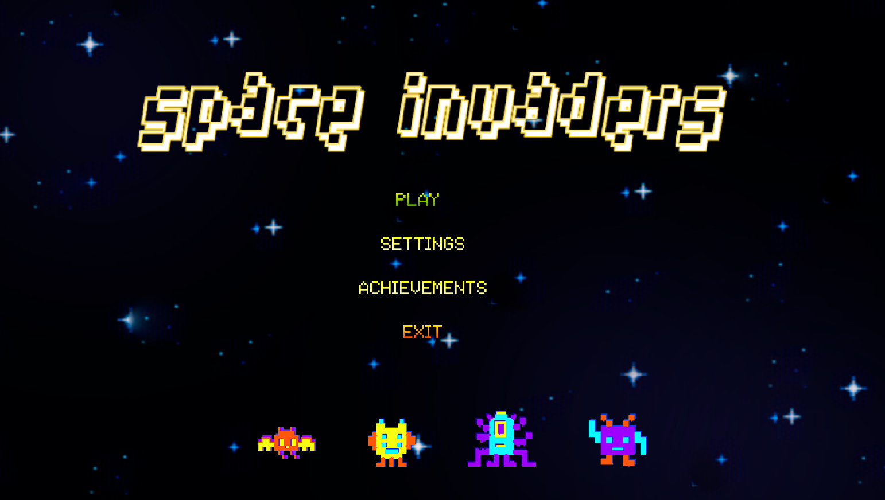

# Space Invaders

Space Invaders game is a classic arcade style 2D shooting game wherein the player spaceship shoots the enemies while avoiding their attacks. In fact, this is the end product of my team's project for _CS350-Introduction to Software Engineering_ from KAIST.

It is freely available to play on
[GX.games](https://gx.games/) via this [link](https://gx.games/games/lvide4/kaist-space-invaders/) or by searching ‘KAIST Space Invaders’ on the platform. Even though it can be played directly within the Chrome browser, it doesn't support direct execution within other browsers. In such a case, one will need to install Opera GX as they mention to run the game. Alternatively, one can download this source code, and run it on the [Game Maker
Studio](https://gamemaker.io/en) installed on the machine.

## Gameplay

The snapshots for the gameplay of battles with bosses is deliberately omitted here to avoid giving spoliers.👀

## Overview of Game Progression

The game is comprised of four phases, whose difficulty is incrementally raised after each phase.
Introducing more advanced enemies and bosses, the game is made progressively challenging.
The game progression can be best illustrated as follows.

- Phase 1
  - 40 enemies (Type 1)
- Phase 2
  - 40 enemies (Type 1 + Type 2)
  - Boss 1
- Phase 3
  - 40 enemies (Type 1 + Type 2 + Type 3)
  - Boss 2
- Phase 4
  - 40 enemies (Type 1 + Type 2 + Type 3 + Type 4)
  - Boss 3

## Enemies and Bosses

Each phase introduces a new type of enemy. Their characteristics are as follows.

- Type 1: static and don’t shoot
- Type 2: static and shoot
- Type 3: dynamic and don’t shoot
- Type 4: dynamic and shoot

Starting from Phase 2, each phase culminates in a boss. Their characteristics are as follows.

- Boss 1: It has many turrets that shoot cannons and lasers in all directions.
- Boss 2: It deflects attacks on most of its surface, and has a small vulnerable area. It means that if the player’s laser hits the areas other than the vulnerable area of the boss, its HP won’t decrease. It can shoot homing missiles along with other various attacks.
- Boss 3: To kill the boss, one must attack specific vulnerable points in a specified order. Otherwise, attacks are ignored. The vulnerable points blink. The final boss has a special attack,
  pulling asteroids from behind the player to attack. If the player evades, the boss may be hit. It can also shoot homing missiles

## Available Options

From Settings in Main Menu, the player can make changes to the audio, controls (keybind), and appearance.

From Achievements of Main Menu, the player can view the past scores of their previous games alongside their respective timestamps.

## License

This work is licensed under a
Creative Commons Attribution-NonCommercial-ShareAlike 4.0 International License.

While you are permitted to use, share and adapt this tool in any reasonable manner, you may not use it for commercial purposes. View detailed info of the [license](https://creativecommons.org/licenses/by-nc-sa/4.0/).

## Our Contributors

This game is possible due to the equal efforts of our amazing contributors.

Made with [contrib.rocks](https://contrib.rocks).
